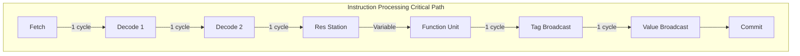
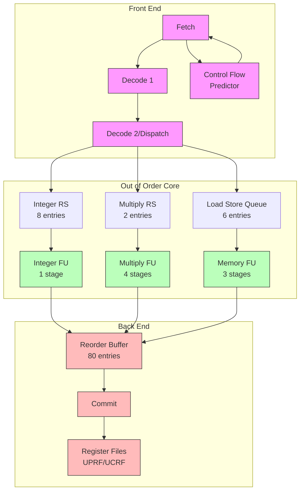
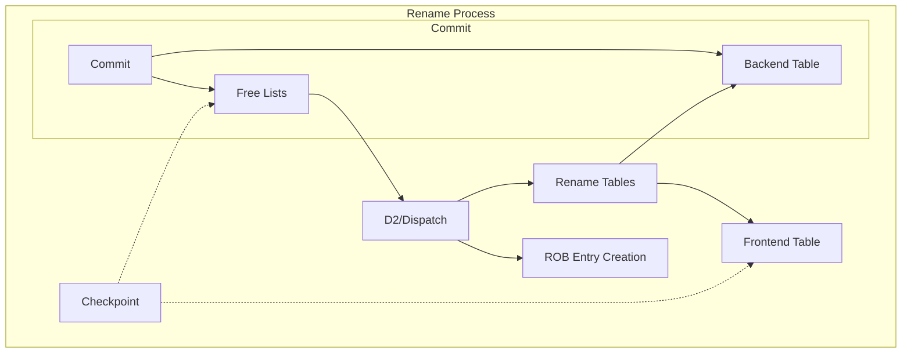
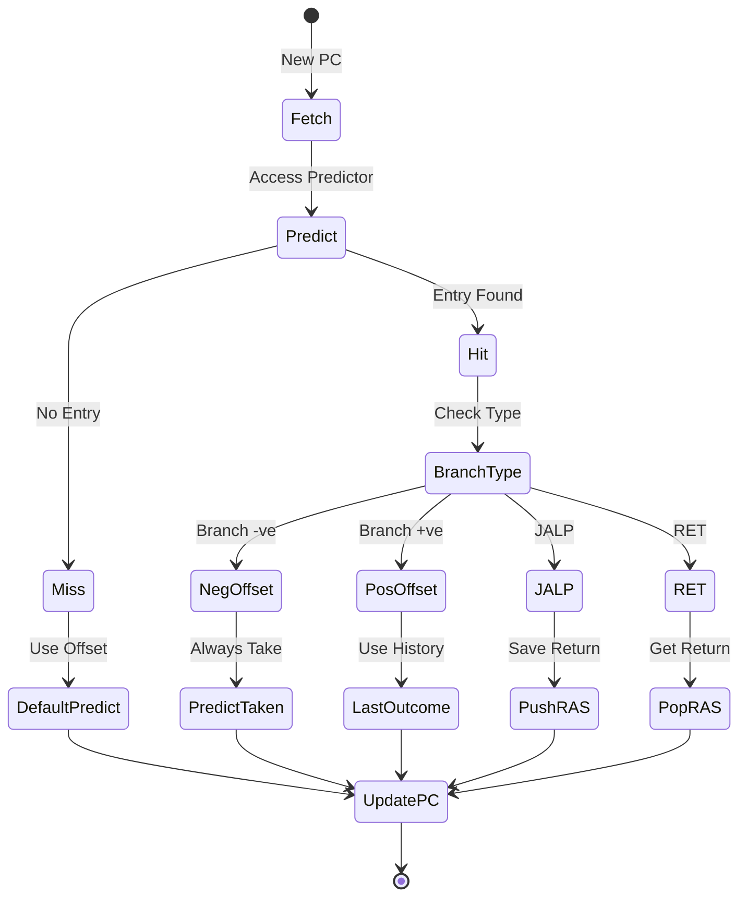
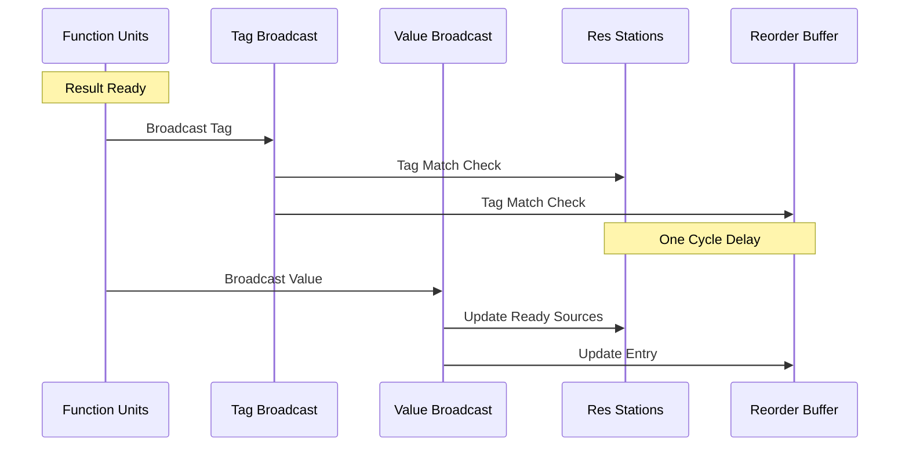
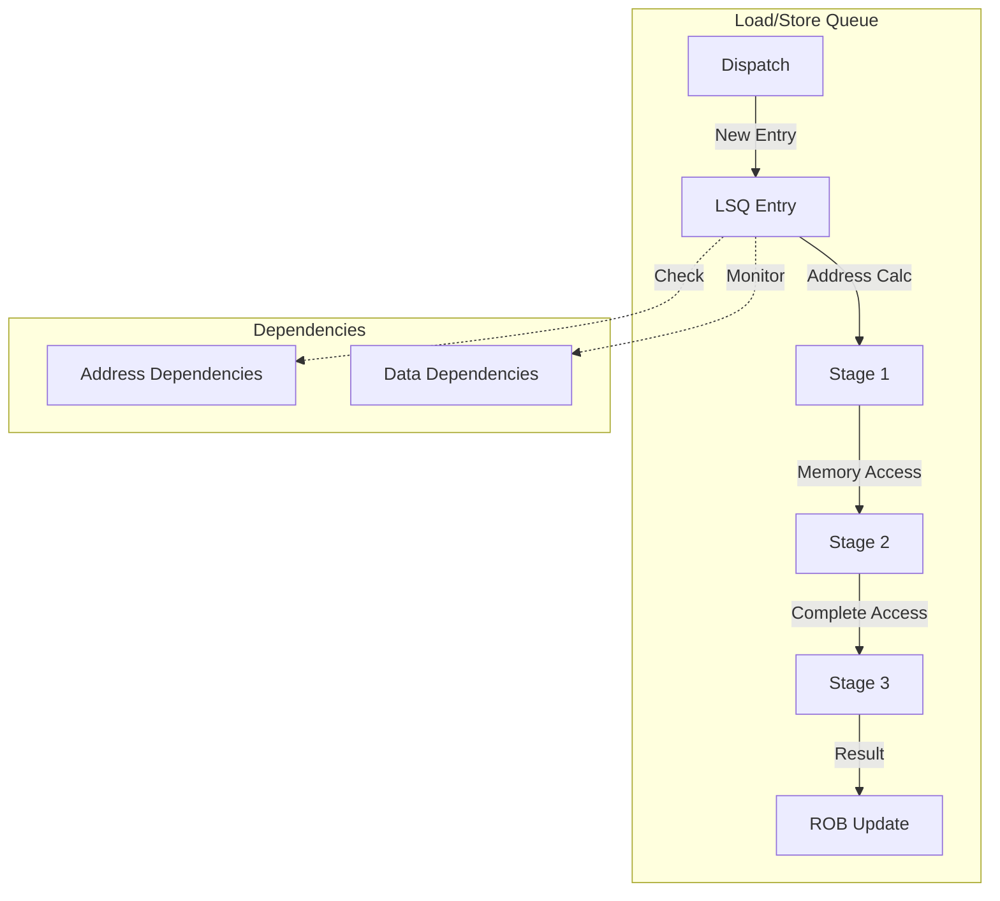
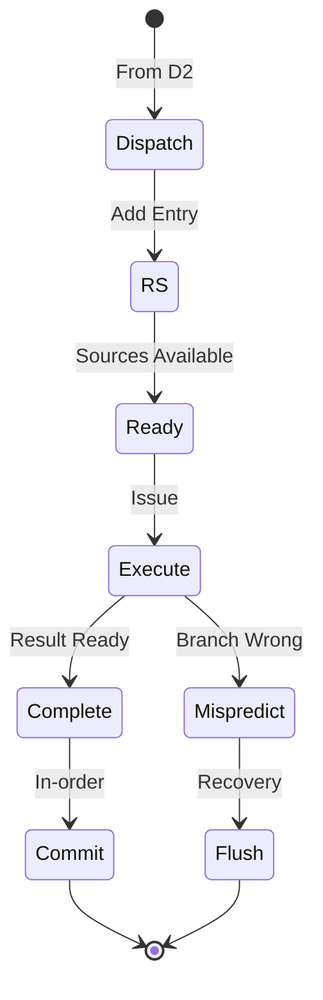

# Out-of-Order APEX Processor Design Documentation
Created by -- Narendra Khatpe

## Table of Contents
- [1. Major Data Structures and Associated Functions](#1-major-data-structures-and-associated-functions)
  - [1.1 Reorder Buffer (ROB)](#11-reorder-buffer-rob)
    - [ROB Functions](#rob-functions)
  - [1.2 Register Management](#12-register-management)
    - [Register Management Functions](#register-management-functions)
  - [1.3 Control Flow Predictor](#13-control-flow-predictor)
    - [Predictor Functions](#predictor-functions)
  - [1.4 Reservation Stations](#14-reservation-stations)
    - [RS Functions](#rs-functions)
  - [1.5 Load/Store Queue (LSQ)](#15-loadstore-queue-lsq)
    - [LSQ Functions](#lsq-functions)
- [2. Critical Path Operations and Timing](#2-critical-path-operations-and-timing)
  - [2.1 Data Dependencies and Critical Paths](#21-data-dependencies-and-critical-paths)
  - [2.2 Timing Requirements](#22-timing-requirements)
  - [2.3 Main Execution Loop](#23-main-execution-loop)
- [3. Interface Specifications](#3-interface-specifications)
  - [3.1 Memory Interface](#31-memory-interface)
  - [3.2 Instruction Fetch Interface](#32-instruction-fetch-interface)
  - [3.3 Result Reporting Interface](#33-result-reporting-interface)
- [4. High-Level Architecture Diagrams](#4-high-level-architecture-diagrams)
  - [4.1 Pipeline Overview](#41-pipeline-overview)
  - [4.2 Register Renaming Flow](#42-register-renaming-flow)
  - [4.3 Control Flow Prediction and Recovery](#43-control-flow-prediction-and-recovery)
  - [4.4 Forwarding Mechanism](#44-forwarding-mechanism)
  - [4.5 LSQ Operation Flow](#45-lsq-operation-flow)
  - [4.6 Instruction State Transitions](#46-instruction-state-transitions)

## 1. Major Data Structures and Associated Functions

### 1.1 Reorder Buffer (ROB)
```cpp
struct ROB_Entry {
    uint32_t pc;               // Instruction address
    InstructionType type;      // Type of instruction (INT/MUL/LOAD/STORE/BRANCH/JALP/RET)
    uint32_t dest_arch_reg;    // Destination architectural register
    uint32_t dest_phys_reg;    // Destination physical register
    uint32_t old_phys_reg;     // Previous mapping (for rollback)
    bool completed;            // Execution status
    uint32_t value;           // Result value
    bool exception;           // Exception status
    bool mispredicted;        // Branch prediction status
    uint32_t target_addr;     // Actual branch target
    uint32_t control_tag;     // For tracking speculative instructions
};

struct ROB {
    ROB_Entry entries[80];    // 80 ROB entries
    int head;                 // Head pointer for commitment
    int tail;                 // Tail pointer for allocation
    int count;               // Number of valid entries
};
```

#### ROB Functions:
```cpp
// Called from D2/Dispatch stage
void Add_ROB_Entry(Instruction inst, RenameInfo rename_info) {
    Actions:
    1. Create new entry at tail
    2. Store instruction info and register mappings
    3. Record old physical register for rollback
    4. Set control tag for speculative path
    5. Update tail pointer
}

// Called during Commit stage
void Commit_Entry() {
    Actions:
    1. Check if head entry is complete
    2. For register instructions:
       - Update backend rename table with new mapping
       - Free old physical register
    3. For branches:
       - Check for misprediction
       - Trigger recovery if needed
    4. For memory:
       - Ensure LSQ operation complete
    5. Advance head pointer
}

// Called by Function Units
void Write_Result(uint32_t rob_idx, uint32_t value, bool mispredict) {
    Actions:
    1. Update entry with result
    2. Set completion status
    3. For branches, set misprediction status
    4. Signal ROB entry ready for commit
}

// Called on misprediction
void Rollback(uint32_t rob_idx) {
    Actions:
    1. Identify all instructions after rob_idx
    2. Restore old physical register mappings
    3. Return freed registers to free list
    4. Reset tail to rob_idx
    5. Signal pipeline flush
    6. Restore checkpointed state
}
```

### 1.2 Register Management
```cpp
struct RenameTable {
    struct Mapping {
        uint32_t phys_reg;    // Physical register number
        bool valid;           // Valid bit
    };
    Mapping arch_to_phys[32]; // Architectural to physical mapping
    Mapping cc_to_phys[1];    // CC flag mapping
};

struct RegisterState {
    RenameTable frontend;     // Frontend rename table
    RenameTable backend;      // Backend rename table (updated at commit)
    Queue<uint32_t> free_list_uprf;  // Free physical registers (60 entries)
    Queue<uint32_t> free_list_ucrf;  // Free CC registers (10 entries)
};
```

#### Register Management Functions:
```cpp
// D2 stage renaming
uint32_t Allocate_Physical_Register() {
    Actions:
    1. Get register from free list
    2. Mark as allocated
    3. Return physical register number
}

// D2 stage renaming
void Update_Frontend_Table(uint32_t arch_reg, uint32_t phys_reg) {
    Actions:
    1. Save old mapping for rollback
    2. Update frontend table entry
    3. Mark old register for future free
}

// Commit stage
void Update_Backend_Table(uint32_t arch_reg, uint32_t phys_reg) {
    Actions:
    1. Update backend table mapping
    2. Free old physical register
    3. Return to free list
}

// Checkpoint for branches
void Save_Register_State() {
    Actions:
    1. Copy frontend table state
    2. Save free list status
    3. Store valid bits
}

// Recovery
void Restore_Register_State(Checkpoint cp) {
    Actions:
    1. Restore frontend table
    2. Restore free lists
    3. Clear speculative mappings
}
```

### 1.3 Control Flow Predictor
```cpp
struct Predictor_Entry {
    bool established;         // Entry validity
    PredictorType type;      // BRANCH/JALP/RET
    uint32_t target_addr;    // Predicted target
    bool last_outcome;       // For positive offset branches
    uint32_t pc;            // Instruction address
    int ras_index;          // RAS pointer for RET
};

struct Return_Stack {
    uint32_t addresses[4];   // 4-entry RAS
    int top;                // Stack pointer
};

struct Control_Predictor {
    Predictor_Entry table[8];  // 8-entry prediction table
    Return_Stack ras;         // Return address stack
    int head;                 // FIFO replacement pointer
};

struct Control_Tag {
    uint32_t tag_id;          // Unique identifier for control instruction
    InstructionType type;     // JUMP/BRANCH/JALP/RET
    uint32_t inst_pc;         // PC of control instruction
    bool resolved;            // Whether target is resolved
};
```

#### Predictor Functions:
```cpp
// Fetch stage lookup
bool Lookup_Prediction(uint32_t pc) {
    Actions:
    1. Search predictor table
    2. On hit:
       - For negative offset branch: predict taken
       - For positive offset branch: use last_outcome
       - For JALP: always taken with target
       - For RET: use RAS prediction
    3. On miss: return default prediction
}

// D2 stage entry creation
void Establish_Predictor_Entry(uint32_t pc, InstructionType type) {
    Actions:
    1. Select victim entry (FIFO)
    2. Initialize fields
    3. Set established bit
    4. For branch: set prediction based on offset
}

// IntFU update
void Update_Predictor(uint32_t pc, bool actual_outcome, uint32_t target) {
    Actions:
    1. Find matching entry
    2. Update last_outcome for positive offset branches
    3. For JALP: push return address to RAS
    4. For RET: verify target matches prediction
}

void Execute_Jump(uint32_t rob_idx) {
    Actions:
    1. Calculate target address
    2. Update PC
    3. Clear fetch_interface.jump_pending
    4. Resume instruction fetch
    5. Clear instructions after JUMP using control tag
}
```

### 1.4 Reservation Stations
```cpp
struct RS_Entry {
    uint32_t pc;             // Instruction address
    OpType operation;        // Operation type
    uint32_t src1_tag;       // Source 1 physical register
    uint32_t src2_tag;       // Source 2 physical register
    uint32_t dest_tag;       // Destination physical register
    bool src1_ready;         // Source 1 availability
    bool src2_ready;         // Source 2 availability
    uint32_t src1_value;     // Source 1 value
    uint32_t src2_value;     // Source 2 value
    uint32_t rob_index;      // ROB entry index
    uint32_t timestamp;      // For oldest-first
    uint32_t control_tag;    // Speculative path tracking
};
```

#### RS Functions:
```cpp
// D2 stage dispatch
void Add_RS_Entry(Instruction inst, RenameInfo rename_info) {
    Actions:
    1. Select appropriate RS (IRS/MRS/LSQ)
    2. Initialize entry fields
    3. Check source readiness
    4. Set control tag
    5. Assign timestamp
}

// Result forwarding
void Update_RS_Sources(uint32_t tag, uint32_t value) {
    Actions:
    1. Search for matching source tags
    2. Update values
    3. Mark sources ready
    4. Check instruction readiness
}

// Issue selection
Instruction Select_For_Issue() {
    Actions:
    1. Find ready instructions
    2. Select oldest ready instruction
    3. Remove from RS
    4. Forward to function unit
}
```

### 1.5 Load/Store Queue (LSQ)
```cpp
struct LSQ_Entry {
    // Core Fields
    uint32_t address;           // Memory address
    uint32_t data;             // Data value/register value for store
    bool is_store;             // Load/Store indicator
    bool address_ready;        // Address calculation status
    uint32_t rob_index;        // Associated ROB entry
    
    // Register Dependencies
    uint32_t base_reg_tag;     // Base register physical tag
    uint32_t offset_reg_tag;   // Offset register physical tag
    uint32_t data_reg_tag;     // Data register tag (for stores)
    bool base_ready;           // Base register value available
    bool offset_ready;         // Offset register value available
    bool data_ready;           // Data value available (for stores)
    
    // Values
    uint32_t base_value;       // Base register value
    uint32_t offset_value;     // Offset value
    
    // Control
    uint32_t age;              // For ordering memory operations
    bool completed;            // Execution status
    bool violated;             // Memory order violation
};

struct LSQ {
    LSQ_Entry entries[6];      // 6-entry queue
    int head;                  // Oldest entry
    int tail;                  // Next free entry
    int count;                 // Number of valid entries
};
```

#### LSQ Functions:
```cpp
// Called from D2/Dispatch
void Add_LSQ_Entry(Instruction inst, RenameInfo rename_info) {
    Actions:
    1. Create entry at tail
    2. Initialize dependency tracking
    3. Set ROB index
    4. Update age counter
    5. Check for structural hazards
}

// Address calculation
void Calculate_Address(uint32_t lsq_index) {
    Actions:
    1. Verify base and offset ready
    2. Compute effective address
    3. Check for memory dependencies
    4. Signal ready for memory access
}

// Memory access control
bool Can_Execute_Memory(uint32_t lsq_index) {
    Actions:
    1. For Loads:
       - Check preceding stores' addresses
       - Verify no unknown addresses
       - Check for store-to-load forwarding
    2. For Stores:
       - Ensure at LSQ head
       - Verify data value available
       - Check ROB position
    3. Return execution permission
}
```

### 2. Critical Path Operations and Timing

#### 2.1 Data Dependencies and Critical Paths


#### 2.2 Timing Requirements Table
| Operation | Cycles | Dependencies | Critical Constraints |
|-----------|--------|--------------|---------------------|
| Fetch | 1 | Predictor lookup | Must complete predictor access |
| Decode 1 | 1 | Instruction valid | None |
| Decode 2 | 1 | Free registers, ROB space | Must allocate all resources |
| IntFU | 1 | Source operands | Must handle forwarding |
| MulFU | 4 | Source operands | Pipeline stalls on resource conflict |
| MemFU | 3 | Address calculation | Must verify memory order |
| Forwarding | 2 | Result ready | 1 cycle tag + 1 cycle value |
| Commit | 1 | ROB head complete | Must update backend state atomically |

### 2.3 Main Execution Loop
```cpp
void Simulate_Cycle() {
    Actions:
    1. Commit Stage:
       - Process ROB head entries
       - Update backend rename table
       - Handle mispredictions

    2. Execute Stage:
       - Process function units
       - Handle forwarding
       - Update ROB entries

    3. Issue Stage:
       - Select ready instructions
       - Forward to function units

    4. Dispatch Stage (D2):
       - Decode instruction
       - If JUMP instruction:
           * Generate unique control tag
           * Set fetch_interface.jump_pending
           * Record JUMP PC
       - Rename registers
       - Create ROB entries
       - Add to reservation stations

    5. Decode Stage (D1):
       - Decode instructions
       - Handle predictor misses

    6. Fetch Stage:
       - Get next instruction
       - Access predictor
       - Update PC
}
```

### 3. Interface Specifications

#### 3.1 Memory Interface
```cpp
struct Memory_Interface {
    // Memory Access Functions
    uint32_t Read_Memory(uint32_t address) {
        Actions:
        1. Check address alignment
        2. Access memory system
        3. Return data with appropriate timing
        4. Handle memory exceptions
    }
    
    void Write_Memory(uint32_t address, uint32_t data) {
        Actions:
        1. Verify store permission
        2. Check address alignment
        3. Update memory system
        4. Signal completion to LSQ
    }
    
    // Memory Status
    bool Is_Busy();          // Memory system availability
    void Handle_Exception(); // Memory exception handling
};
```

#### 3.2 Instruction Fetch Interface
```cpp
struct Fetch_Interface {
    bool jump_pending;        // Flag for JUMP in progress
    uint32_t jump_pc;         // PC of current JUMP
    
    // Fetch Control
    Instruction Fetch_Next() {
        Actions:
        1. Check jump_pending flag
        2. If jump_pending, return NOP
        3. Otherwise:
           - Access instruction memory
           - Check for fetch exceptions
           - Update fetch PC
           - Handle prediction lookup
    }
    
    // PC Management
    void Update_PC(uint32_t new_pc) {
        Actions:
        1. Handle PC redirect
        2. Clear fetch buffer
        3. Update predictor state
    }
    
    // Fetch Status
    bool Is_Fetch_Stalled();
    uint32_t Get_Current_PC();
};
```

#### 3.3 Result Reporting Interface
```cpp
struct Result_Interface {
    // Performance Monitoring
    struct Stats {
        uint64_t cycles;            // Total cycles
        uint64_t instructions;      // Committed instructions
        uint64_t branches;          // Branch instructions
        uint64_t mispredictions;    // Branch mispredictions
        uint64_t memory_ops;        // Memory operations
        // ... other statistics
    };
    
    // Reporting Functions
    void Update_Stats(Event event);
    void Print_Status();
    void Generate_Trace();
    void Log_Event(EventType type, uint32_t data);
};
```
## 4. High-Level Architecture Diagrams

### 4.1 Pipeline Overview


### 4.2 Register Renaming Flow


### 4.3 Control Flow Prediction and Recovery


### 4.4 Forwarding Mechanism


### 4.5 LSQ Operation Flow


### 4.6 Instruction State Transitions



